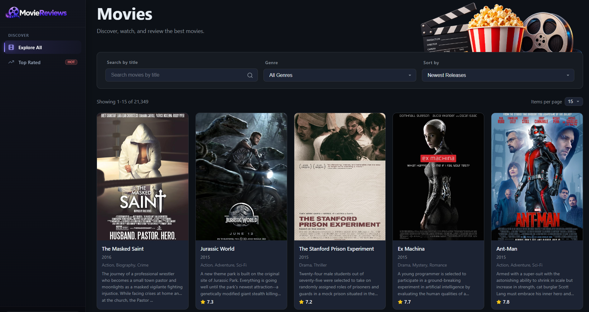
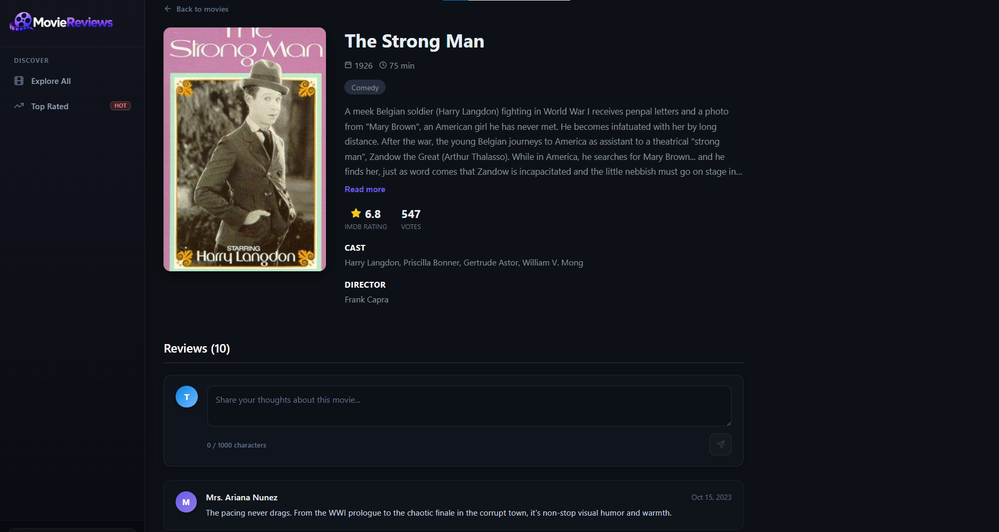

# Cinevo: Movie Discovery and Reviews

A MERN stack movie application built using MongoDB's **sample_mflix** dataset, which contains more than **21,000** movies. 

Users can search movies by title, filter them by genre, sort them by rating or release year, and browse the collection using server-side pagination with MongoDB `skip` and `limit`. 

The Express backend follows a **layered architecture** with **routes**, **controllers**, and **repositories**, where routes define the endpoints, controllers handle request and response logic, and repositories manage MongoDB queries.

The movie details page uses MongoDB `$lookup` to fetch the movie and its reviews in a single query. Users can add reviews, while editing and deleting reviews is limited to the user who created them.





## API Endpoints

| Method | Endpoint | Description |
|---|---|---|
| GET | `/api/v1/movies/` | List movies with pagination, title, genre, and sort filters |
| GET | `/api/v1/movies/id/:id` | Get a movie and its reviews by `id` |
| GET | `/api/v1/movies/genres` | Get available movie genres |
| POST | `/api/v1/movies/reviews` | Create a review |
| PUT | `/api/v1/movies/reviews` | Update a review |
| DELETE | `/api/v1/movies/reviews` | Delete a review |

## Running it locally

You'll need Node 18+ and a MongoDB Atlas cluster loaded with the **sample_mflix** dataset (the free tier is enough).

**Server**

```bash
cd server
npm install
```

Create **server/.env**:

```
MONGODB_URI=your-mongodb-atlas-connection-string
MONGODB_NS=sample_mflix
PORT=8000
```

```bash
node index.js
```

**Client**

```bash
cd client
npm install
```

Create **client/.env**:

```
VITE_API_URL=http://localhost:8000
```

```bash
npm start
```

## License

This project is licensed under the [MIT](LICENSE) License.